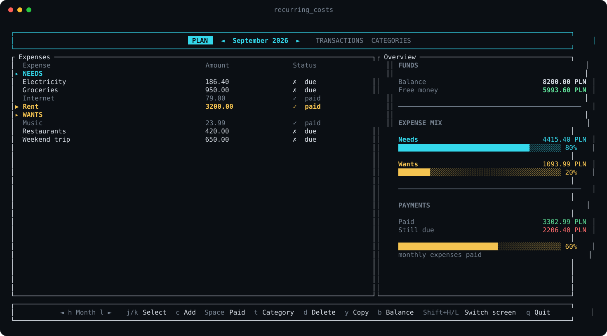

# Recurring Costs

A fast, keyboard-first expense tracker for the terminal. Recurring Costs keeps each month’s bills, available balance, spending mix, and payment progress together in a focused Ratatui interface.



## Highlights

- Organize expenses by month and by **Need** or **Want**.
- Mark bills as paid without removing them from the monthly plan.
- See balance, free money, category split, and payment progress at a glance.
- Copy a recurring expense into the following month.
- Keep a history of balance updates.
- Use Vim keys or arrow keys throughout the interface.
- Store data locally—no account, server, or network connection required.

## Getting started

You’ll need a recent Rust toolchain and a terminal with Unicode support.

```sh
git clone <repository-url>
cd expense-tracker
cargo run --release
```

To build a standalone binary instead:

```sh
cargo build --release
./target/release/recurring_costs
```

## Controls

### Expense list

| Key | Action |
| --- | --- |
| `j` / `↓`, `k` / `↑` | Select an expense |
| `h` / `←`, `l` / `→` | Move between months |
| `Space` | Mark the selected expense paid or unpaid |
| `i` | Add an expense |
| `t` | Switch the selected expense between Need and Want |
| `c` | Copy the selected expense to the next month |
| `d` | Delete the selected expense |
| `b` | Update the month’s balance |
| `o` | Open the full overview |
| `q` | Quit |

### Overview and history

| Key | Action |
| --- | --- |
| `b` | Update the balance |
| `H` | Open balance history |
| `Esc` | Go back |
| `q` | Quit |

### Dialogs

Use `Tab` to move between expense fields, the arrow keys or `n` / `w` to choose a category, `Enter` to save, and `Esc` to cancel. Amounts accept either a decimal point or comma.

## Local data

The application saves `expenses_data.json` and its log inside the platform data directory:

- macOS: `~/Library/Application Support/recurring_costs/`
- Linux: `~/.local/share/recurring_costs/`
- Windows: `%APPDATA%/recurring_costs/`

Back up `expenses_data.json` if you want to move your data to another machine.

## Built with

- [Ratatui](https://ratatui.rs/) for the terminal UI
- [Crossterm](https://github.com/crossterm-rs/crossterm) for terminal input and output
- [Serde](https://serde.rs/) for local data serialization
- [Chrono](https://github.com/chronotope/chrono) for dates and balance history

## Contributing

Bug reports, feature ideas, and pull requests are welcome. Before opening a pull request, run:

```sh
cargo fmt -- --check
cargo test
```

## License

Licensed under the [MIT License](LICENSE).
