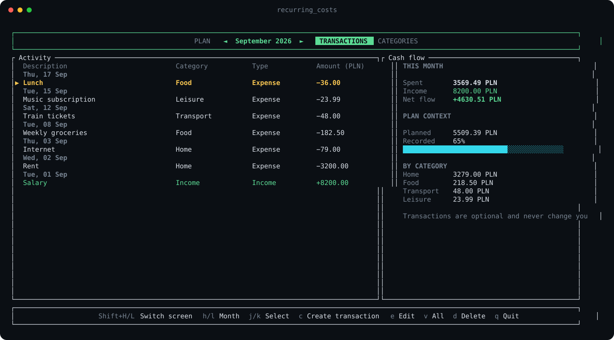

# Recurring Costs

A fast, keyboard-first expense tracker for the terminal. Recurring Costs brings a monthly bill planner, an optional transaction ledger, and customizable categories together in a focused Ratatui interface. Track what is due, record what you actually spend or earn, and compare the two.


*Plan view with sample data. Free money is the month’s balance minus unpaid planned expenses.*

## Highlights

- **Monthly plan:** group bills into Need and Want, mark them paid, and copy individual recurring expenses to the next month.
- **Balance overview:** see free money, spending mix, payment progress, and a history of balance updates.
- **Transaction ledger:** record and edit dated expenses and income, browse a month or the full ledger, and scroll through long lists.
- **Cash-flow summary:** see spending, income, net flow, the top six spending categories, and recorded spending as a percentage of the monthly plan.
- **Custom categories:** create and rename categories for expenses, income, or both; categories in use are protected from deletion.
- **Category picker:** filter compatible categories while entering a transaction, with a scrolling list that keeps the selection visible.
- **Keyboard navigation:** use Vim keys or arrows, switch screens with `Shift+H/L`, and open the shortcut reference with `?`.
- **Local storage:** no account, server, or network connection required.

## Getting started

You’ll need a recent Rust toolchain and a terminal with Unicode support.

```sh
git clone <repository-url>
cd expense-tracker
cargo run --release
```

To build a standalone binary instead:

```sh
cargo build --release
./target/release/recurring_costs
```

## Controls

Press `?` from any normal screen to open the complete keyboard shortcut reference. Press `Esc` to return.

`Shift+H` and `Shift+L` move through the top-level screens in either direction: Plan, Transactions, and Categories. Lowercase `h` and `l` continue to move between months where applicable.

### Plan

| Key | Action |
| --- | --- |
| `j` / `↓`, `k` / `↑` | Select an expense |
| `h` / `←`, `l` / `→` | Move between months |
| `Space` | Mark the selected expense paid or unpaid |
| `c` | Create an expense |
| `t` | Switch the selected expense between Need and Want |
| `y` | Copy the selected expense to the next month |
| `d` | Delete the selected expense |
| `b` | Update the month’s balance |
| `o` | Open the full overview |
| `Shift+H` / `Shift+L` | Move between Plan, Transactions, and Categories |
| `q` | Quit |

The top navigation labels can also be clicked with the mouse.

### Transactions

Transaction tracking is an optional, separate workflow. Nothing recorded in the ledger changes the monthly plan or marks a planned expense as paid.

| Key | Action |
| --- | --- |
| `c` | Create a transaction |
| `e` | Edit the selected transaction |
| `v` | Toggle between the selected month and all transactions |
| `j` / `↓`, `k` / `↑` | Select a transaction |
| `h` / `←`, `l` / `→` | Move between months |
| `d` | Delete the selected transaction |
| `Shift+H` / `Shift+L` | Move between Plan, Transactions, and Categories |
| `q` | Quit |



*Transaction view using sample data. The sidebar follows the selected month or the full ledger; plan comparison appears only in monthly mode.*

The transaction form records a date (`YYYY-MM-DD`), description, positive amount, type (expense or income), and category. In the type field, use `Space` or `←/→` to switch between expense and income. Use `Tab` between fields, `Enter` to save, and `Esc` to cancel.

Type into the category field to filter it, then use `j/k` or `↑/↓` to select a match. The picker shows categories compatible with the selected type and keeps the highlighted match visible as you scroll. New categories can apply to expenses, income, or both. The all-transactions view keeps the selected row visible while navigating long ledgers.

### Categories

The Categories screen lists every category, whether it applies to expenses or income, its usage count, and its status. Use `j` / `k` to select, `c` to create, `e` to edit, and `d` to delete. Categories used by transactions cannot be deleted.

### Overview and history

From Plan, press `o` for the full overview, then `Shift+H` for the selected month’s balance history. History records the balance, total planned expenses, unpaid expenses, and remaining funds at each balance update.

| Key | Action |
| --- | --- |
| `b` | Update the balance |
| `Shift+H` | Open balance history from the overview |
| `Esc` | Go back |
| `q` | Quit |

### Dialogs

Use `Tab` to move between expense fields, the arrow keys or `n` / `w` to choose Need/Want, `Enter` to save, and `Esc` to cancel. Amounts accept either a decimal point or comma.

## Development

Pull requests targeting `main` run the full Rust test suite automatically through GitHub Actions. Run it locally with:

```sh
cargo test --all-targets
```

## Local data

The application saves `expenses_data.json` and its log inside the platform data directory:

- macOS: `~/Library/Application Support/recurring_costs/`
- Linux: `~/.local/share/recurring_costs/`
- Windows: `%APPDATA%/recurring_costs/`

The JSON file contains monthly plans, balances and their history, transactions, and transaction categories. Back up `expenses_data.json` if you want to move your data to another machine.

## Built with

- [Ratatui](https://ratatui.rs/) for the terminal UI
- [Crossterm](https://github.com/crossterm-rs/crossterm) for terminal input and output
- [Serde](https://serde.rs/) for local data serialization
- [Chrono](https://github.com/chronotope/chrono) for dates and balance history

## Contributing

Bug reports, feature ideas, and pull requests are welcome. Before opening a pull request, run:

```sh
cargo fmt -- --check
cargo test
```

## License

Licensed under the [MIT License](LICENSE).
